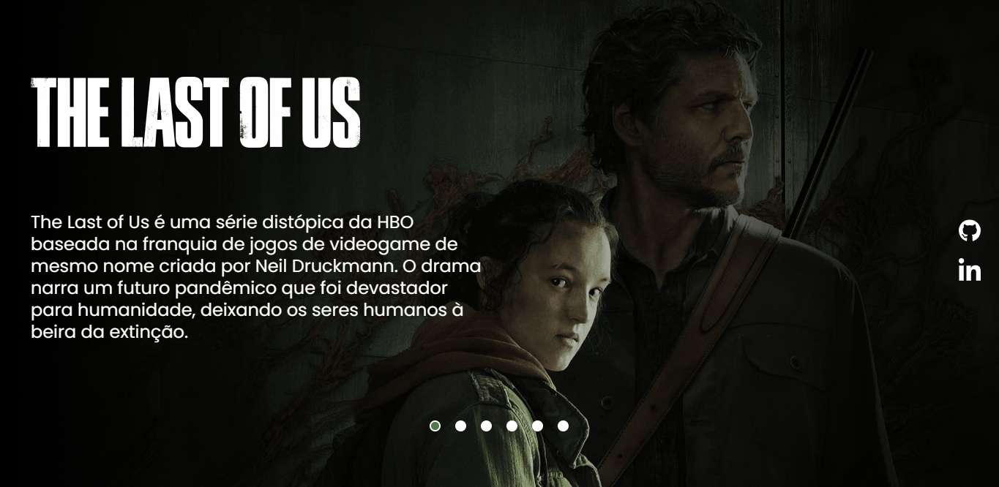

# Projeto The Last of Us
Um pequeno passo para uma grande caminhada😊

[](https://mateus-j.github.io/projeto-the-last-of-us/)

## Tecnologias utilizadas👨‍💻

[](https://apexensino.com.br/base-da-programacao-front-end/)

## Como utilizar📌
1 - Clone para o projeto
```
git clone https://github.com/Mateus-J/projeto-the-last-of-us.git
```

2 - Acesse a pasta do projeto
```
git cd projeto-the-last-of-us.git
```

3 - Inicie o projeto com o VS Code
```
code .
```

# Seja Feliz 🎇